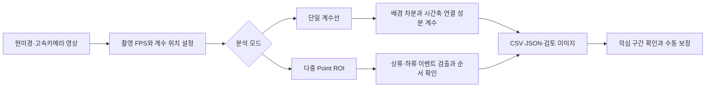

[English](README.md) | **한국어**

# MEMS Droplet Counter

MEMS·마이크로플루이딕 실험 영상에서 드롭렛과 기포가 몇 개 통과했는지 세고, 계수 오류가 의심되는 구간을 확인하는 연구용 도구입니다.

긴 현미경 영상을 프레임 단위로 살펴보며 방울을 세는 수고를 줄이려고 만들었습니다. 분석할 영상과 계수 위치를 고르면 방울이 통과한 순간을 이벤트로 기록합니다. 채널별 개수와 통과 순서를 비교하고, 판단이 어려운 구간은 다시 확인할 수 있습니다.

## 왜 이 도구가 필요한가요?

드롭렛 기반 마이크로플루이딕 실험에서는 작은 방울 하나에 시료를 담거나, 방울 자체를 반응 공간으로 사용합니다. 방울이 몇 개 지나갔는지와 시간에 따른 통과 빈도를 기록하면 실험 조건을 비교하고 이상 구간을 찾는 데 도움이 됩니다. 채널마다 정해진 순서로 방울을 분배하는 실험에서는 그 순서가 유지되는지도 확인해야 합니다. 영상으로 드롭렛의 움직임과 시간에 따른 변화를 분석하는 방법은 기존 연구에서도 다뤄졌습니다. [DMV 연구](https://doi.org/10.1039/c3lc50074h), [드롭렛 생성 과정의 연속 모니터링 연구](https://doi.org/10.1063/1.5102131).

방울을 눈으로 세다 보면 같은 구간을 여러 번 돌려보게 됩니다. 방울이 빠르게 움직이거나 서로 겹칠 때, 배경과 대비가 약할 때는 특히 판단하기 어렵습니다. 자동으로 센 결과와 해당 프레임을 함께 확인할 수 있도록, 계수와 검토 기능을 한 도구에 담았습니다.

| 연구 중 필요한 작업 | 이 도구가 제공하는 기능 |
| --- | --- |
| 긴 영상에서 방울 수 세기 | 지정한 계수선을 통과하는 이벤트 자동 기록 |
| 시간대별 발생량 비교 | 시간 구간별 카운트, 이벤트 시각, 평균 발생률 저장 |
| 여러 채널의 동작 비교 | 1~9개 Point의 회전 ROI와 개별 카운트 |
| 순차 분배 실험의 이상 확인 | 예상 Point 순서와 실제 통과 순서를 비교하는 `count error` 기록 |
| 애매한 결과 재확인 | 의심 이벤트 목록, 주변 프레임 검토, 수동 ±1 보정 |
| 분석 근거 보관 | CSV·JSON 결과, 리듬 이미지, 선택적 주석 영상·검토 클립 |

이 도구는 영상에서 확인할 수 있는 통과 개수와 시점을 측정합니다. 픽셀 크기는 검출 기준을 정하고 의심 이벤트를 찾는 데 사용합니다. µm 단위의 실제 지름이나 방울 부피를 계산하는 기능은 없습니다.

## 전체 동작 흐름



GUI와 CLI는 같은 Python 분석 모듈을 사용합니다. 분석은 사용자 컴퓨터에서 실행하며, 학습된 신경망 모델이나 클라우드 API 키는 필요하지 않습니다.

## 설치하고 실행하기

Python 3.10 이상과 OpenCV, NumPy가 필요합니다. GUI는 Tkinter를 사용합니다. Windows에서는 Tkinter가 포함된 Python을 설치한 뒤 저장소 폴더에서 실행하세요.

```powershell
git clone https://github.com/sel00000/mems-droplet-counter.git
cd mems-droplet-counter
py -3 -m pip install -r requirements.txt
py -3 -m bubble_counter gui
```

설치 후에는 `start_gui.bat`를 더블클릭해 실행할 수도 있습니다. Linux에서는 같은 명령의 `py -3`을 `python3`으로 바꾸면 됩니다. Tkinter가 없는 환경에서도 CLI 분석은 사용할 수 있습니다.

### GUI로 분석하기

1. 분석할 영상을 선택합니다.
2. 단일 계수에서는 관심영역(ROI), 계수선 위치와 방향, 밴드 폭을 맞춥니다.
3. 멀티웨이에서는 실촬영 FPS·해상도를 지정하고, 각 Point의 회전 ROI와 흐름 방향, 기준 기포 크기를 설정합니다.
4. 분석을 시작하고 카운트와 진행 상황을 확인합니다.
5. 결과 폴더의 CSV를 열거나 검토 화면에서 의심 이벤트와 `count error` 주변 프레임을 확인합니다.
6. 필요한 이벤트를 수동 보정하고 보정 이유를 남깁니다.

멀티웨이 설정은 프로파일로 저장해 다음 분석에 다시 쓸 수 있습니다. 카메라 위치나 배율, 채널 배치가 바뀌었다면 ROI와 기준 크기도 다시 확인하세요.

### 샘플 영상 없이 동작 확인하기

합성 영상을 만들고 동일한 계수 파이프라인으로 분석할 수 있습니다.

```powershell
py -3 -m bubble_counter synth out/demo.avi --duration 5 --rate 2
py -3 -m bubble_counter count out/demo.avi -o out/count --band 64 --save-rhythm --annotate
```

`out/demo.avi.gt.json`에서 합성 영상의 정답 통과 수를, `out/count/summary.json`에서 검출 결과를 확인할 수 있습니다. 이 예제는 프로그램 실행과 회귀 검증에 사용합니다. 실제 연구 영상에서의 정확도는 별도로 확인해야 합니다.

## 어떻게 방울을 세나요?

### 1. 배경과 움직이는 대상을 분리합니다

단일 계수에서는 영상을 관심영역으로 자르고, 필요하면 공간 해상도를 줄입니다. 이어서 OpenCV의 MOG2 배경 차분으로 전경 마스크를 만듭니다. 고정된 채널 배경에서 방울이 움직이며 일으키는 밝기 변화를 찾는 과정입니다.

분석 구간의 프레임은 건너뛰지 않고 순서대로 읽습니다. `--scale`을 조절하면 영상의 가로·세로 크기가 줄어들고, 프레임 간격은 그대로 유지됩니다. 단일 계수에서 초기 `--warmup` 프레임은 배경 학습에 쓰며 카운트에서는 제외합니다.

구현: [`pipeline.py`](bubble_counter/pipeline.py), [`video_io.py`](bubble_counter/video_io.py).

### 2. 계수선 주변의 변화를 시간축으로 쌓습니다

계수선 주변에는 얇은 밴드를 둡니다. 수평 계수선이라면 각 프레임에서 밴드 안의 전경을 세로 방향으로 합쳐 한 줄의 신호를 만듭니다. 전경 마스크를 $F_t(x,y)$라고 할 때 식은 다음과 같습니다.

$$
r_t(x)=\max_{y\in\mathrm{band}} F_t(x,y)
$$

이 신호를 시간 순서대로 쌓으면 visual rhythm(시공간 리듬) 이미지가 됩니다. 가로축은 계수선 위 위치, 세로축은 시간입니다. 여러 프레임에 걸쳐 보이는 방울 하나가 이 이미지에서는 시간축을 따라 이어진 흔적을 만듭니다.

```text
                계수선 위 위치 →
시간 ↓          · · █ █ · · · ·
                · · █ █ · · · ·   연결된 흔적 A
                · · · · · · · ·
                · · · · · █ █ ·
                · · · · · █ █ ·   연결된 흔적 B

                조건을 만족한 흔적 A, B → 2개
```

### 3. 연결된 흔적을 하나의 통과로 판정합니다

`RhythmCounter`는 프레임을 읽을 때마다 리듬 신호의 8방향 연결 성분을 추적합니다. 연결된 흔적이 끝나면 폭과 면적 조건을 검사해 통과 여부를 판정합니다. 방울이 계수선에 여러 프레임 동안 머물러도 프레임마다 중복해서 세지 않도록 하는 방식입니다.

| 설정 | 역할 |
| --- | --- |
| `--band` | 계수선 주변에서 움직임을 모으는 밴드 폭 |
| `--row-close` | 한 줄 신호의 작은 공간적 틈을 연결 |
| `--merge-gap` | 짧은 시간적 끊김을 같은 흔적으로 연결 |
| `--min-width`, `--min-area` | 작은 잡음 흔적 제외 |
| `--var-threshold` | 배경 변화와 전경을 구분하는 민감도 조절 |

밴드가 너무 좁으면 빠른 방울을 놓칠 수 있습니다. 틈을 연결하는 조건을 너무 강하게 적용하면 가까이 있는 방울들이 하나의 흔적으로 합쳐질 수도 있습니다. 실제 영상의 짧은 구간을 눈으로 확인하면서 설정을 맞추세요.

구현: [`rhythm.py`](bubble_counter/rhythm.py), [`config.py`](bubble_counter/config.py).

### 4. 프레임을 실험 시간으로 환산합니다

기록한 프레임 번호 $k$와 실촬영 프레임률 $f_s$로 통과 시각을 계산합니다.

$$
t_k=\frac{k}{f_s},\qquad \bar{q}=\frac{N}{T_{\mathrm{counted}}}
$$

$N$은 검출한 통과 수, $T_{\mathrm{counted}}$는 실제 계수 대상 구간의 길이입니다. 단일 계수의 평균 발생률은 워밍업을 뺀 구간으로 계산합니다. 통과 시각의 차이 $t_{i+1}-t_i$는 CSV를 이용한 후속 분석에서 방울 사이 시간 간격을 비교하는 데 사용할 수 있습니다.

슬로모션 영상은 파일의 재생 FPS와 카메라의 촬영 FPS가 다를 수 있습니다. 단일 계수의 `--fps`와 멀티웨이의 `--recording`에는 실제 촬영 FPS를 입력하세요. 이 값이 맞아야 통과 시각과 발생률을 실험 시간에 맞게 계산할 수 있습니다.

## 멀티웨이와 count error의 원리

멀티웨이에서는 채널 배치에 맞춰 회전 사각형 ROI(Point)를 1~9개 설정합니다. 각 ROI를 채널 방향에 맞게 변환하고 상류·하류 밴드에서 흔적을 찾습니다. 이벤트는 하류 통과를 기준으로 만듭니다. 초기 구간의 중앙값 영상으로 배경 모델을 준비한 다음, 전체 구간을 다시 읽으며 계수합니다.

기준 픽셀 크기와 상류 신호의 유무, 흔적이 시간상으로 이어지는지를 살펴 `weak-bubble`, `merge-suspect`, `boundary-size`, `no-upstream` 같은 플래그를 남깁니다. 이 표시는 다시 확인할 근거를 제공하며, 이벤트가 생긴 물리적 원인까지 확정하지는 않습니다.

### 순서 게이트

기본 설정인 `order_gate=True`는 **P1 → P2 → … → PN → P1** 순서로 방울이 통과한다고 가정합니다. 다음 차례의 Point에서 통과가 관측되어야 카운트에 포함합니다. 다른 Point가 먼저 관측되면 `count error`를 기록하고, 원래 기다리던 Point를 계속 기다립니다.

예를 들어 3-way에서 `P1, P3, P2, P3`가 관측되면 다음과 같이 처리합니다.

| 관측 | 기대 Point | 처리 |
| --- | --- | --- |
| P1 | P1 | 수락, 다음은 P2 |
| P3 | P2 | `count error`, 계속 P2를 기다림 |
| P2 | P2 | 수락, 다음은 P3 |
| P3 | P3 | 수락, 1 set 완성 |

`count error`는 설정한 순서와 달라 카운트에 포함하지 않은 통과 사건을 뜻합니다. 정답 데이터와 비교한 검출 오차율이나, 확인된 유체 결함의 개수와는 다릅니다. 서로 독립적으로 흐르는 채널에는 이 순서 가정이 맞지 않을 수 있습니다. 이런 경우에는 단일 계수를 사용하거나 Python API의 `MultiwayConfig(..., order_gate=False)`로 독립 계수를 설정하세요.

구현: [`engine.py`](bubble_counter/multiway/engine.py), [`sequence.py`](bubble_counter/multiway/sequence.py), [`model.py`](bubble_counter/multiway/model.py).

### 자동 결과와 사람의 판단을 함께 보관합니다

검토 화면에서 이벤트가 기록된 프레임과 주변 구간을 확인할 수 있습니다. 누락했거나 잘못 센 이벤트는 ±1로 보정합니다. 보정 내용은 프레임, Point, 변화량, 이유와 함께 `corrections_log.csv`에 따로 남기고, 이를 반영해 순서와 집계를 다시 계산합니다. 이물이 의심되는 영역을 살피고 검토용 클립과 감사 기록을 남길 수도 있습니다.

구현: [`gui_review.py`](bubble_counter/multiway/gui_review.py), [`corrections.py`](bubble_counter/multiway/corrections.py), [`audit.py`](bubble_counter/multiway/audit.py).

## CLI 사용 예시

### 단일 계수

```powershell
py -3 -m bubble_counter count experiment.avi -o out/experiment --line-axis h --line-pos 0.5 --band 32 --fps 300 --save-rhythm
```

`--line-pos`는 ROI 안에서의 상대 위치이며, `--roi X Y W H`는 원본 프레임에 대한 0~1 비율입니다. 흐름을 가로지르는 방향으로 계수선을 놓으세요. 처리 속도를 확인하려면 다음 명령을 사용합니다.

```powershell
py -3 -m bubble_counter bench experiment.avi --seconds 5 --fps 300
```

### 다중 Point 계수

`points.json`에 Point 배치를 저장합니다. 아래는 2-way 형식 예시이며, 좌표와 각도는 실제 영상에 맞춰 바꿔야 합니다.

```json
[
  {"number": 1, "cx": 0.5, "cy": 0.3, "length": 0.08, "width": 0.10, "angle_deg": 0.0},
  {"number": 2, "cx": 0.5, "cy": 0.7, "length": 0.08, "width": 0.10, "angle_deg": 0.0}
]
```

`cx`, `cy`는 중심의 상대 좌표입니다. `length`는 흐름 방향 길이를 프레임 너비로 나눈 값, `width`는 가로지르는 폭을 프레임 높이로 나눈 값입니다. `angle_deg=0`은 오른쪽 방향을 기준으로 합니다.

```powershell
py -3 -m bubble_counter multiway experiment.avi --recording 1280x768@300:dma --points points.json --bubble circle:50 --phase-name experiment -o out/multiway
```

`circle:50`은 기준 크기 50픽셀을 뜻합니다. 실제 촬영 설정과 ROI, 기준 크기를 확인한 뒤 사용하세요. 여러 영상을 입력하면 입력 순서대로 각각 하나의 챕터로 처리하고, 이 챕터들을 하나의 페이즈로 묶습니다.

## 결과 파일

| 모드 | 주요 파일 | 내용 |
| --- | --- | --- |
| 단일 | `summary.json` | 카운트, 처리 구간, 평균 발생률, 사용 설정 |
| 단일 | `counts.csv` | 시간 구간별 카운트 |
| 단일 | `marks.csv` | 흔적의 첫 프레임·시각·지속 프레임·픽셀 폭·면적 |
| 단일, 선택 | `annotated.avi`, `rhythm_*.png` | 주석 영상과 시공간 리듬 이미지 |
| 멀티웨이 | `multiway_summary.json`, `point_counts.csv` | 챕터 요약과 Point별 카운트 |
| 멀티웨이 | `events.csv` | 통과 이벤트와 플래그 |
| 멀티웨이 | `count_errors.csv`, `violations.csv` | 순서 불일치 사건; 기본 순서 게이트에서는 미계수 사건 |
| 멀티웨이 | `suspects.csv`, `filtered_out.csv` | 의심 구간과 필터에서 제외한 흔적의 근거 |
| 멀티웨이 | `phase_summary.json` | 여러 챕터를 묶은 요약 |
| 수동 검토 | `corrections_log.csv` | 사람의 보정 이력 |

원본 촬영 영상은 입력으로 읽고, 분석 산출물은 지정한 출력 폴더에 저장합니다. 설정별 결과를 비교할 때는 출력 폴더를 각각 지정하세요.

## 기술 구성

| 구성 | 사용 기술 | 역할 |
| --- | --- | --- |
| 영상 처리 | OpenCV | 디코딩, MOG2 배경 차분, ROI 회전 변환, 형태학 연산 |
| 수치 연산 | NumPy | 마스크·리듬 신호, 배경 통계와 좌표 계산 |
| 사용자 화면 | Tkinter / ttk | 영상 선택, ROI·파라미터 설정, 진행 화면과 검토 |
| 계수와 순서 판단 | Python | 연결 성분 스트리밍 계수, Point 순서 상태 관리 |
| 결과 기록 | CSV / JSON | 실험 후 분석과 재검토를 위한 데이터 저장 |
| Windows 패키징 | PyInstaller | GUI를 실행 파일과 의존 파일 묶음으로 빌드 |

```text
bubble_counter/
├── cli.py, gui.py             명령줄과 기본 GUI
├── pipeline.py, rhythm.py     단일 계수 파이프라인
├── video_io.py, geometry.py   영상 입출력과 계수 영역 좌표
├── gui_multiway.py            다중 Point 설정과 실행
└── multiway/                  다중 계수, 순서 판정, 결과 검토와 보정
tests/                        자동 테스트와 캘리브레이션 이미지
packaging/                    Windows GUI 빌드 스크립트
requirements.txt              실행 의존성
start_gui.bat                 Windows 소스 실행 바로가기
```

## 검증과 적용 범위

```powershell
py -3 -m pip install pytest
py -3 -m pytest -q
```

게시한 코드는 Python 3.12.3, OpenCV 4.13.0, NumPy 2.4.5 환경에서 기본 테스트 640개를 통과했습니다. 합성 영상 계수부터 다중 Point 처리와 순서 판정, 수동 보정, 보고서 저장, GUI 상태 로직까지 검증합니다.

실제 영상의 결과를 정답과 비교하는 테스트 5개에는 `gt_gate` 표시가 붙어 있으며, 기본 테스트 실행에서는 제외합니다. 해당 검증 클립과 정답 CSV를 별도로 준비한 뒤 `python -m pytest -q -m gt_gate`로 실행할 수 있습니다. 저장소에는 자동 테스트용 캘리브레이션 이미지를 담았습니다. 원본 연구 영상과 내부 정답표는 포함하지 않았습니다.

- 촬영 FPS, 노출, 대비, 초점, 방울 사이 간격과 ROI 배치가 계수 결과에 영향을 줍니다.
- 녹화 단계에서 놓친 통과나 영상에서 구분되지 않는 방울을 소프트웨어가 복원하지는 못합니다.
- 픽셀 크기 기준과 순서 오류 표시는 분석을 돕는 지표이며, 실제 크기·부피나 유체 현상의 확정 판정으로 해석하면 안 됩니다.
- 자동 테스트를 통과해도 실험 영상에 따라 정확도는 달라질 수 있습니다. 새 실험 조건에서는 사람이 확인한 짧은 구간과 먼저 비교하세요.
- 이번 게시 검증은 WSL의 CLI·자동 테스트 기준입니다. Windows GUI의 실제 조작과 실행 파일 빌드는 별도 환경 확인이 필요합니다.

### Windows 실행 파일 빌드

Windows에서 실행 의존성을 설치한 후 아래 스크립트를 실행합니다. PyInstaller가 없으면 스크립트가 설치합니다.

```powershell
powershell -ExecutionPolicy Bypass -File packaging\build_windows.ps1
```

결과는 `dist/기포계수툴/`과 날짜가 붙은 ZIP으로 생성됩니다. 실행 파일을 배포할 때는 `_internal`을 포함한 폴더 전체가 필요합니다.

## 공동 제작

**Kyung-Bo Kim ([@sel00000](https://github.com/sel00000))과 Claude가 함께 만든 프로젝트입니다.**

MEMS 연구에서 드롭렛을 편리하게 세고, 측정 중 판단이 어려운 구간을 연구자가 직접 확인할 수 있도록 개발했습니다.

## 참고 연구

드롭렛 영상 분석과 시간에 따른 변화 관찰의 배경을 이해하는 데 참고한 연구입니다. 각 논문의 구현과 성능 수치는 이 프로젝트의 구현·성능과 별개입니다.

1. A. S. Basu, *Droplet morphometry and velocimetry (DMV): a video processing software for time-resolved, label-free tracking of droplet parameters*, **Lab on a Chip** 13, 1892–1901 (2013). [DOI: 10.1039/c3lc50074h](https://doi.org/10.1039/c3lc50074h).
2. Z. Z. Chong et al., *Automated droplet measurement (ADM): an enhanced video processing software for rapid droplet measurements*, **Microfluidics and Nanofluidics** 20, 66 (2016). [DOI: 10.1007/s10404-016-1722-5](https://doi.org/10.1007/s10404-016-1722-5).
3. *A real-time cosine similarity algorithm method for continuous monitoring of dynamic droplet generation processes*, **AIP Advances** 9, 105201 (2019). [DOI: 10.1063/1.5102131](https://doi.org/10.1063/1.5102131).
