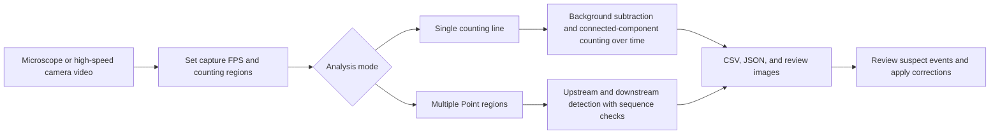

**English** | [한국어](README.ko.md)

# MEMS Droplet Counter

A desktop research tool that counts droplets and bubbles in MEMS and microfluidics videos and helps you review suspected counting errors.

We built it to reduce the time spent stepping through long microscope recordings and counting droplets by hand. Choose a video, place the counting regions, and the tool records passage events. You can compare counts across channels, check whether events follow the expected sequence, and return to the frames that need a closer look.

## Why this tool is useful

In droplet microfluidics, individual droplets can hold samples or act as small reaction compartments. Recording how many droplets pass a location and how their passage rate changes helps researchers compare experimental conditions. In experiments designed to distribute droplets in a particular channel order, the sequence matters too. Video analysis has been used to quantify droplet behavior and monitor changes during generation. See the [DMV study](https://doi.org/10.1039/c3lc50074h) and the [study on continuous monitoring of droplet generation](https://doi.org/10.1063/1.5102131).

Manual counting often means watching the same segment several times. Fast motion, overlapping droplets, and low contrast make some events difficult to judge. This tool combines automatic counting with frame review so you can inspect the evidence behind an uncertain result.

| Research task | What the tool provides |
| --- | --- |
| Count droplets in a long recording | Automatic recording of events crossing a selected counting line |
| Compare passage rates over time | Counts by time interval, event timestamps, and mean passage rate |
| Compare several channels | Rotatable regions of interest and separate counts for 1 to 9 Points |
| Check a sequential distribution experiment | `count error` records when observed Point order differs from the expected order |
| Revisit uncertain results | Suspect event lists, surrounding frames, and manual ±1 corrections |
| Keep a record of the analysis | CSV and JSON results, visual rhythm images, and optional annotated videos and review clips |

Here, measurement means counting visible passage events and recording when they occur. Pixel dimensions help set detection thresholds and flag suspect events. The tool does not calculate physical droplet diameter in µm or droplet volume.

## Workflow



The GUI and CLI use the same Python analysis modules. Processing runs locally and requires no trained neural network or cloud API key.

## Install and run

You need Python 3.10 or later, OpenCV, and NumPy. The GUI uses Tkinter. On Windows, install Python with Tkinter support, then run these commands:

```powershell
git clone https://github.com/sel00000/mems-droplet-counter.git
cd mems-droplet-counter
py -3 -m pip install -r requirements.txt
py -3 -m bubble_counter gui
```

After installation, you can also double-click `start_gui.bat`. On Linux, replace `py -3` with `python3`. The CLI works in environments without Tkinter.

### Analyze a video in the GUI

1. Select the video.
2. For single-line counting, adjust the region of interest (ROI), line position and orientation, and band width.
3. For multiway analysis, enter the actual capture FPS and resolution. Set each Point's rotated ROI, flow direction, and reference bubble size.
4. Start the analysis and watch the count and progress display.
5. Open the output CSV files, or use the review window to inspect suspect events and frames around a `count error`.
6. Correct events where needed and record a reason for each correction.

You can save multiway settings as a profile and reuse them. Check the ROIs and reference size again if the camera position, magnification, or channel layout changes.

### Try it without a recording

Generate a synthetic video and run it through the counting pipeline:

```powershell
py -3 -m bubble_counter synth out/demo.avi --duration 5 --rate 2
py -3 -m bubble_counter count out/demo.avi -o out/count --band 64 --save-rhythm --annotate
```

`out/demo.avi.gt.json` contains the ground-truth crossing count for the generated video. The detected result is saved in `out/count/summary.json`. This example checks that the pipeline runs and supports regression testing; it does not establish accuracy on experimental recordings.

## How counting works

### 1. Separate moving objects from the background

The single-line pipeline crops the video to the ROI, optionally reduces its spatial resolution, and uses OpenCV's MOG2 background subtraction to produce a foreground mask. This identifies intensity changes caused by moving droplets against the fixed channel background.

Frames in the analysis interval are read in sequence. `--scale` reduces image dimensions without skipping frames. In single-line mode, the initial `--warmup` frames train the background model and are excluded from the count.

Implementation: [`pipeline.py`](bubble_counter/pipeline.py), [`video_io.py`](bubble_counter/video_io.py).

### 2. Build a visual rhythm along the counting line

A narrow band surrounds the counting line. For a horizontal line, the pipeline collapses the foreground mask vertically within that band into a one-dimensional signal. If the foreground mask is $F_t(x,y)$, the signal is:

$$
r_t(x)=\max_{y\in\mathrm{band}} F_t(x,y)
$$

Stacking these signals in time produces a visual rhythm image. Its horizontal axis represents position along the counting line, and its vertical axis represents time. A droplet visible across several frames can therefore form one continuous trace.

```text
                Position along the counting line →
Time ↓          · · █ █ · · · ·
                · · █ █ · · · ·   Connected trace A
                · · · · · · · ·
                · · · · · █ █ ·
                · · · · · █ █ ·   Connected trace B

                If A and B meet the criteria, the count is 2.
```

### 3. Count connected traces

`RhythmCounter` tracks 8-connected components in the rhythm signal as frames arrive. When a connected trace ends, the counter checks its width and area. This lets a droplet remain visible at the line for several frames without being counted once per frame.

| Setting | Purpose |
| --- | --- |
| `--band` | Set the width of the band that collects motion around the counting line |
| `--row-close` | Close small spatial gaps in each one-dimensional signal |
| `--merge-gap` | Join traces separated by short gaps in time |
| `--min-width`, `--min-area` | Exclude small noise traces |
| `--var-threshold` | Adjust sensitivity to foreground changes relative to the background |

A band that is too narrow can miss fast droplets. Aggressive gap closing can join nearby droplets into one trace. Check a short segment by eye when choosing settings for an experimental recording.

Implementation: [`rhythm.py`](bubble_counter/rhythm.py), [`config.py`](bubble_counter/config.py).

### 4. Convert frames to experimental time

The recorded frame index $k$ and actual capture frame rate $f_s$ determine the event time:

$$
t_k=\frac{k}{f_s},\qquad \bar{q}=\frac{N}{T_{\mathrm{counted}}}
$$

$N$ is the detected crossing count, and $T_{\mathrm{counted}}$ is the duration included in counting. In single-line mode, the mean passage rate excludes the warmup interval. You can use timestamp differences $t_{i+1}-t_i$ from the CSV output to compare intervals between droplets in further analysis.

A slow-motion video's playback FPS may differ from the camera's capture FPS. Set `--fps` in single-line mode, or the FPS field of `--recording` in multiway mode, to the actual capture rate so that timestamps and rates reflect experimental time.

## Multiway analysis and count errors

Multiway analysis supports 1 to 9 rotated rectangular ROIs, called Points, placed to match the channel layout. Each ROI is transformed to follow the channel direction. Traces are detected in upstream and downstream bands, and the downstream crossing defines an event. The pipeline first prepares the background model from the median of an initial video segment, then reads the full interval again for counting.

Reference pixel size, upstream signal presence, and temporal continuity help assign flags such as `weak-bubble`, `merge-suspect`, `boundary-size`, and `no-upstream`. These flags identify evidence worth reviewing; they do not establish the physical cause of an event.

### Sequence gate

The default setting, `order_gate=True`, expects events in the order **P1 → P2 → … → PN → P1**. A crossing is accepted only when it occurs at the next expected Point. If another Point is observed first, the tool records a `count error` and continues waiting for the same expected Point.

For example, a 3-way sequence of `P1, P3, P2, P3` is handled as follows:

| Observed Point | Expected Point | Result |
| --- | --- | --- |
| P1 | P1 | Accept; expect P2 next |
| P3 | P2 | Record a `count error`; keep waiting for P2 |
| P2 | P2 | Accept; expect P3 next |
| P3 | P3 | Accept; complete one set |

A `count error` is a passage event rejected because it does not match the configured sequence. It is not a detection error rate measured against ground truth or a count of confirmed fluidic defects. Independently flowing channels may not fit this sequence assumption. Use single-line counting for those cases, or configure independent counting through the Python API with `MultiwayConfig(..., order_gate=False)`.

Implementation: [`engine.py`](bubble_counter/multiway/engine.py), [`sequence.py`](bubble_counter/multiway/sequence.py), [`model.py`](bubble_counter/multiway/model.py).

### Keep automatic results and manual decisions together

The review window lets you inspect an event and nearby frames, then apply a ±1 correction for a missed or incorrectly counted event. Corrections are recorded separately in `corrections_log.csv`, including the frame, Point, adjustment, and reason. The sequence and totals are recalculated with those corrections applied. You can also inspect suspected foreign objects, generate review clips, and keep audit records.

Implementation: [`gui_review.py`](bubble_counter/multiway/gui_review.py), [`corrections.py`](bubble_counter/multiway/corrections.py), [`audit.py`](bubble_counter/multiway/audit.py).

## CLI examples

### Single-line counting

```powershell
py -3 -m bubble_counter count experiment.avi -o out/experiment --line-axis h --line-pos 0.5 --band 32 --fps 300 --save-rhythm
```

`--line-pos` is the relative position within the ROI. `--roi X Y W H` uses fractions of the original frame, from 0 to 1. Place the counting line across the flow. To measure processing speed, run:

```powershell
py -3 -m bubble_counter bench experiment.avi --seconds 5 --fps 300
```

### Multiple Points

Save the Point layout in `points.json`. This is a 2-way example; adjust the coordinates and angles to your video.

```json
[
  {"number": 1, "cx": 0.5, "cy": 0.3, "length": 0.08, "width": 0.10, "angle_deg": 0.0},
  {"number": 2, "cx": 0.5, "cy": 0.7, "length": 0.08, "width": 0.10, "angle_deg": 0.0}
]
```

`cx` and `cy` are relative center coordinates. `length` is the extent along the flow divided by the frame width; `width` is the extent across the flow divided by the frame height. `angle_deg=0` uses the rightward direction as its reference.

```powershell
py -3 -m bubble_counter multiway experiment.avi --recording 1280x768@300:dma --points points.json --bubble circle:50 --phase-name experiment -o out/multiway
```

`circle:50` specifies a reference size of 50 pixels. Check the capture settings, ROIs, and reference size before running the analysis. When you supply several videos, each becomes a chapter in the order given, and the chapters are grouped into one phase.

## Output files

| Mode | Main files | Contents |
| --- | --- | --- |
| Single-line | `summary.json` | Count, processed interval, mean passage rate, and settings |
| Single-line | `counts.csv` | Counts by time interval |
| Single-line | `marks.csv` | First frame, timestamp, duration in frames, pixel width, and area of each trace |
| Single-line, optional | `annotated.avi`, `rhythm_*.png` | Annotated video and visual rhythm images |
| Multiway | `multiway_summary.json`, `point_counts.csv` | Chapter summary and per-Point counts |
| Multiway | `events.csv` | Passage events and flags |
| Multiway | `count_errors.csv`, `violations.csv` | Sequence mismatches; with the default sequence gate, these events are not counted |
| Multiway | `suspects.csv`, `filtered_out.csv` | Suspect intervals and reasons for excluding traces |
| Multiway | `phase_summary.json` | Summary across chapters |
| Manual review | `corrections_log.csv` | Manual correction history |

The tool reads the original recording and writes analysis results to the selected output folder. Use separate output folders when comparing different settings.

## Technology and project layout

| Component | Technology | Role |
| --- | --- | --- |
| Video processing | OpenCV | Decoding, MOG2 background subtraction, rotated ROI transforms, and morphological operations |
| Numerical processing | NumPy | Masks, rhythm signals, background statistics, and coordinate calculations |
| Desktop interface | Tkinter / ttk | Video selection, ROI and parameter settings, progress display, and review |
| Counting and sequence logic | Python | Streaming connected-component counting and Point sequence state management |
| Result storage | CSV / JSON | Data for further analysis and review |
| Windows packaging | PyInstaller | Bundle the GUI with an executable and its dependencies |

```text
bubble_counter/
├── cli.py, gui.py             CLI and main GUI
├── pipeline.py, rhythm.py     Single-line counting pipeline
├── video_io.py, geometry.py   Video I/O and counting-region coordinates
├── gui_multiway.py            Multi-Point setup and analysis
└── multiway/                  Multiway counting, sequence checks, review, and corrections
tests/                        Automated tests and calibration images
packaging/                    Windows GUI build scripts
requirements.txt              Runtime dependencies
start_gui.bat                 Windows launcher for running from source
```

## Validation and limitations

```powershell
py -3 -m pip install pytest
py -3 -m pytest -q
```

The published code passed the 640 tests in the default suite with Python 3.12.3, OpenCV 4.13.0, and NumPy 2.4.5. The suite covers synthetic-video counting, multi-Point processing, sequence checks, manual corrections, report output, and GUI state logic.

Five additional tests that check experimental recordings against ground truth are marked `gt_gate` and excluded from the default run. To run them, supply the corresponding validation clips and ground-truth CSV files, then use `python -m pytest -q -m gt_gate`. The repository includes calibration images for automated tests. Original research recordings and internal ground-truth tables are not included.

- Capture FPS, exposure, contrast, focus, droplet spacing, and ROI placement affect the results.
- The software cannot recover crossings missed during recording or distinguish droplets that are visually inseparable in the footage.
- Pixel-size thresholds and sequence flags support review. They do not establish physical size, volume, or the cause of a fluidic event.
- Passing the automated tests does not establish the same accuracy for every experiment. Compare a short, manually checked segment before using the tool under new conditions.
- Publication checks used the CLI and automated tests in WSL. Interactive operation of the Windows GUI and the executable build still need verification in that environment.

### Build the Windows executable

On Windows, install the runtime dependencies and run the build script below. It installs PyInstaller if needed.

```powershell
powershell -ExecutionPolicy Bypass -File packaging\build_windows.ps1
```

The script creates `dist/기포계수툴/` and a ZIP archive with a date in its filename. Distribute the entire application folder, including `_internal`.

## Authors

Built together by **Kyung-Bo Kim ([@sel00000](https://github.com/sel00000)) and Claude**.

The project was developed to make droplet counting more convenient in MEMS research and give researchers a way to inspect uncertain events in their recordings.

## References

These papers provide background on droplet video analysis and monitoring over time. Their implementations and reported performance are separate from those of this project.

1. A. S. Basu, *Droplet morphometry and velocimetry (DMV): a video processing software for time-resolved, label-free tracking of droplet parameters*, **Lab on a Chip** 13, 1892–1901 (2013). [DOI: 10.1039/c3lc50074h](https://doi.org/10.1039/c3lc50074h).
2. Z. Z. Chong et al., *Automated droplet measurement (ADM): an enhanced video processing software for rapid droplet measurements*, **Microfluidics and Nanofluidics** 20, 66 (2016). [DOI: 10.1007/s10404-016-1722-5](https://doi.org/10.1007/s10404-016-1722-5).
3. *A real-time cosine similarity algorithm method for continuous monitoring of dynamic droplet generation processes*, **AIP Advances** 9, 105201 (2019). [DOI: 10.1063/1.5102131](https://doi.org/10.1063/1.5102131).
